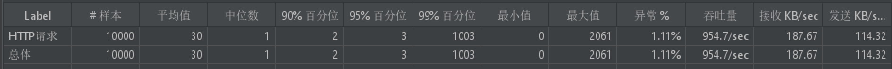

# @`Hand-Written Tomcat`

## `Tomcat`请求流程：

获取字节，交给`Servlet`

`Tomcat`核心就是交由一个`Context`，放入里面的`Servlet`

`socket`编程，获取调用方法，封装`request`对象

在一个`Tomcat`里面，不用根据`ip`区分，就只用域名区分

## 组件：

`PipeLine`经过`Valve`的思路

## 字节流转化`HttpServlet`:

`socket`网络编程 `nio/bio`网络`io`模型

不行的啊，发现他的讲授思路完全就是按照源码来讲解，就是说直接讲源码，我觉得根本没有必要把源码全部看懂，我就需要简单实现一个就可以，所以后面的源码我就不去看了

## `IO`模型

通过不同的`IO`模型实现不同的获取`socket`套接字

对于`tcp`协议来说，首先`socket`函数创建`socket`实例

之后`bind`函数绑定端口号

之后是状态转换的函数`listen`, `connect`

分别变成被动监听和主动连接的状态，同时内核创建两个队列，半连接队列和全连接队列，`connect`激活`tcp`三次握手，成功建立连接的放入全连接队列，系统调用`accpet`获得套接字，即使没有发送消息也会一直阻塞等待该`socket`的消息，如果`socket`关闭的话，那就继续下面的操作，可能会继续调用`accept`获取新的已经连接好的套接字

## `zero-copy`

文件数据一般地首先经过内核模式`copy`到用户模式，因此需要`copy`四次

如果使用`zero-copy`的技术，那就是直接在`kernel`模式直接完成

另外最终的`zero-copy`技术就是使用`socket`直接记录索引，从而实现拷贝两次，实现`zero-copy`

## 阻塞`IO`

`IO`的各种流是阻塞的。这意味着，当一个线程调用`read()` 或 `write()`时，该线程被阻塞，直到有一些数据被读取，或数据完全写入。该线程在此期间不能再干任何事情了。 `NIO`的非阻塞模式，使一个线程从某通道发送请求读取数据，但是它仅能得到目前可用的数据，如果目前没有数据可用时，就什么都不会获取。而不是保持线程阻塞，所以直至数据变得可以读取之前，该线程可以继续做其他的事情。 非阻塞写也是如此。一个线程请求写入一些数据到某通道，但不需要等待它完全写入，这个线程同时可以去做别的事情。 线程通常将非阻塞`IO`的空闲时间用于在其它通道上执行`IO`操作，所以一个单独的线程现在可以管理多个输入和输出通道`channel`

## `Connector`执行流程

##### `initialize`执行

初始化对应的标志位，以及使用工厂模式创建服务端监听套接字

##### `start`执行

`Connector`实现了`Runnable`接口，但是此时并没有开启线程执行`run`方法，主要介绍一下`start`方法，首先保证阻塞队列`processor`池中有足够的`processor`

##### `newProcessor`方法

注意到初始化`processor`都是通过这个方法实现的，基本的思路就是`processor`里面有`thread`的成员变量，然后初始化实例然后执行，每次创建`processor`之后会阻塞在`await`方法处，等待有分配的套接字进行处理，否则一直阻塞在此处

##### `recycle`方法

在执行`process`实际处理请求结束之后，会回收到阻塞队列里面去，`recyle`方法看上去有问题，其实只在开启线程之后，保证空闲的线程被回收，不会让线程重复回收，所以其实也没有问题，因为就是创建之后同步地立马放到阻塞队列中，但是可能会再阻塞队列中获取到执行的，但是这个时候的`assign`方法就会阻塞线程，但是重复回收是不会执行的，因此`recyle`的代码的都是同步执行的

##### `start`主方法

然后创建线程执行`run`方法，保证不断监听`accpet`获取已建立的套接字，创建`processor`，分配套接字，获取`processor`的方式，要么是通过获取已经回收的阻塞队列中的，要么就是直接创建，直接创建也参考线程池的做法，创建当前线程的时候就会分配资源开启线程

##### 聚合报告：

##### 汇总报告：

### 

### `NIO`实现

基本上通过重新封装`connector`, `processor`实现对应的功能，主要是熟悉`nio`面向`channel`和`buffer`的流程，然后把`select`的流程加入到`web server`中
